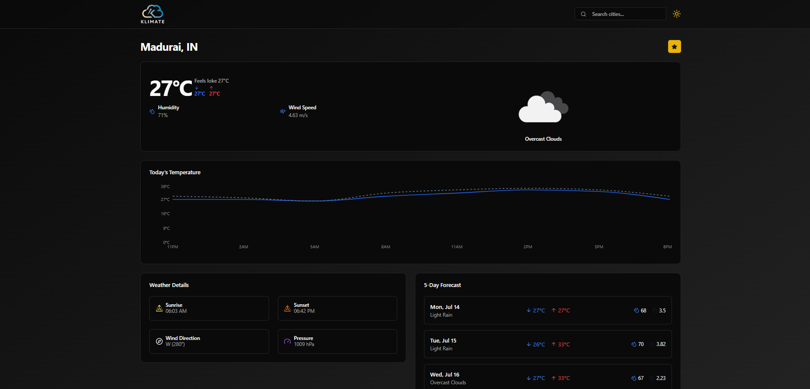

<div align="center">
  <br />
  
  <br />
  <br/>
  <!-- Tech Stack Badges -->
  <div style={"margin-top:2px"}>
    
    
    
    
    
    
    
  </div>

  <h3 align="center">🌦️ Klimate – Weather Intelligence Dashboard</h3>

  <div align="center">
    A dynamic, multi-language weather dashboard built with React 19, Tailwind CSS, Radix UI, and React Query. Delivers live weather analytics with interactive UI, charts, themes, and localization.
  </div>

  <br />
  <div align="center">
    🌐 <strong>Live Demo</strong>: <a href="https://KarthickRamAlagar.github.io/klimate/">Klimate -Live Demo/a>
  </div>

  <br />

  <!-- Personal Links -->
  <div align="center">
    <a href="https://github.com/karthickramalagar">
      
    </a>
    <a href="[https://linkedin.com/in/karthickramalagar](https://www.linkedin.com/in/karthickeyan-ramalagar-763404370/)">
      
    </a>
    <a href="mailto:karthickramalagar@gmail.com">
      
    </a>
  </div>
</div>

---

## 📋 Table of Contents

1. [Introduction](#-introduction)  
2. [Tech Stack](#-tech-stack)  
3. [Features](#-features)  
4. [Quick Start](#-quick-start)  
5. [Installation](#-installation)  
6. [License](#-license)  
7. [Acknowledgements](#-acknowledgements)  

---

### 🚀 Introduction

**Klimate** is a responsive, intelligent weather dashboard built using the latest frontend technologies.  
It features real-time weather data, dynamic charts, a theme system, and multi-language support.

Designed to be fast, responsive, and developer-friendly, this project is great for showcasing UI architecture, query management, and localization with i18next.

---

### 🔧 Tech Stack

- ⚛ **React 19** – UI Library  
- ⚡ **Vite** – Build tool for instant development  
- 💨 **Tailwind CSS** – Utility-first CSS framework  
- 🎯 **Radix UI** – Unstyled accessible component primitives  
- 🌍 **i18next** – Internationalization  
- 📊 **Recharts** – Declarative charting library  
- 🔄 **React Query** – Async state & data fetching  
- 📆 **date-fns** – Modern date utility  
- 🧩 **Lucide + Sonner + cmdk** – UI/UX enhancements  
- 🌐 **GitHub Pages** – Deployment

---

## ⚙ Features

- ✅ **City-based Weather Dashboard** with routing  
- 🌐 **Multi-language support** via `react-i18next`  
- 🌞 **Light/Dark Theme toggle** with `next-themes`  
- 📊 **Dynamic Weather Charts** using Recharts  
- ⚡ **React Query** for efficient API caching  
- 🧠 **Radix UI Dialogs & Tooltips**  
- 🌈 **Smooth Animations** via Tailwind Animate  
- 🖼 **Responsive layout** for mobile & desktop  
- 🚀 **Deployed via GitHub Pages** with `gh-pages`

---

## ⚡ Quick Start

### 📦 Prerequisites

- Node.js ≥ 18  
- npm or pnpm


### 🛠️ Installation

```bash
git clone https://github.com/KarthickRamAlagar/klimate.git
cd klimate
```
### Install dependencies
```npm install```

### Start development server
```
npm run dev
```
### 🔨 Build & Deploy
```bash
npm run build        # Build the production files
npm run deploy       # Deploy to GitHub Pages
```
### 🙏 Acknowledgements
- React
- Vite
- Tailwind CSS
- Radix UI
- Recharts
- React Query
- i18next
- GitHub Pages
## Expanding the ESLint configuration

If you are developing a production application, we recommend updating the configuration to enable type-aware lint rules:

```js
export default tseslint.config([
  globalIgnores(['dist']),
  {
    files: ['**/*.{ts,tsx}'],
    extends: [
      // Other configs...

      // Remove tseslint.configs.recommended and replace with this
      ...tseslint.configs.recommendedTypeChecked,
      // Alternatively, use this for stricter rules
      ...tseslint.configs.strictTypeChecked,
      // Optionally, add this for stylistic rules
      ...tseslint.configs.stylisticTypeChecked,

      // Other configs...
    ],
    languageOptions: {
      parserOptions: {
        project: ['./tsconfig.node.json', './tsconfig.app.json'],
        tsconfigRootDir: import.meta.dirname,
      },
      // other options...
    },
  },
])
```

You can also install [eslint-plugin-react-x](https://github.com/Rel1cx/eslint-react/tree/main/packages/plugins/eslint-plugin-react-x) and [eslint-plugin-react-dom](https://github.com/Rel1cx/eslint-react/tree/main/packages/plugins/eslint-plugin-react-dom) for React-specific lint rules:

```js
// eslint.config.js
import reactX from 'eslint-plugin-react-x'
import reactDom from 'eslint-plugin-react-dom'

export default tseslint.config([
  globalIgnores(['dist']),
  {
    files: ['**/*.{ts,tsx}'],
    extends: [
      // Other configs...
      // Enable lint rules for React
      reactX.configs['recommended-typescript'],
      // Enable lint rules for React DOM
      reactDom.configs.recommended,
    ],
    languageOptions: {
      parserOptions: {
        project: ['./tsconfig.node.json', './tsconfig.app.json'],
        tsconfigRootDir: import.meta.dirname,
      },
      // other options...
    },
  },
])
```
